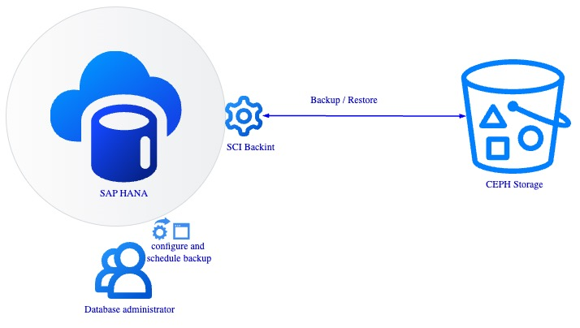
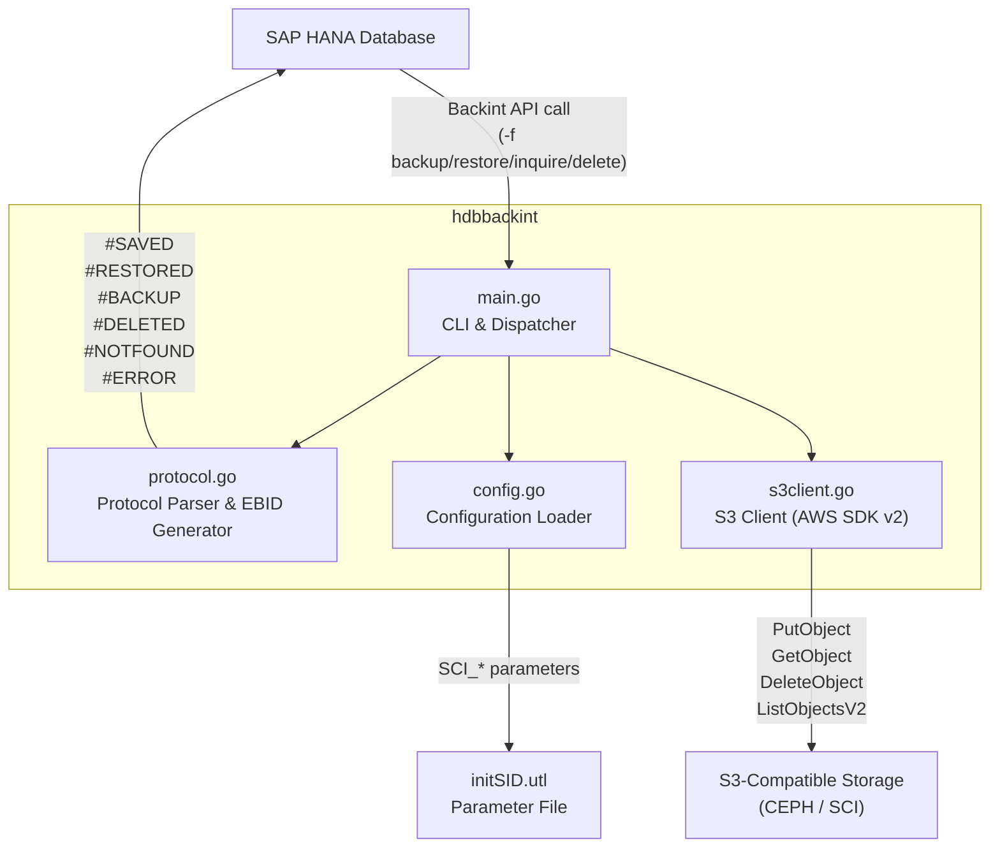
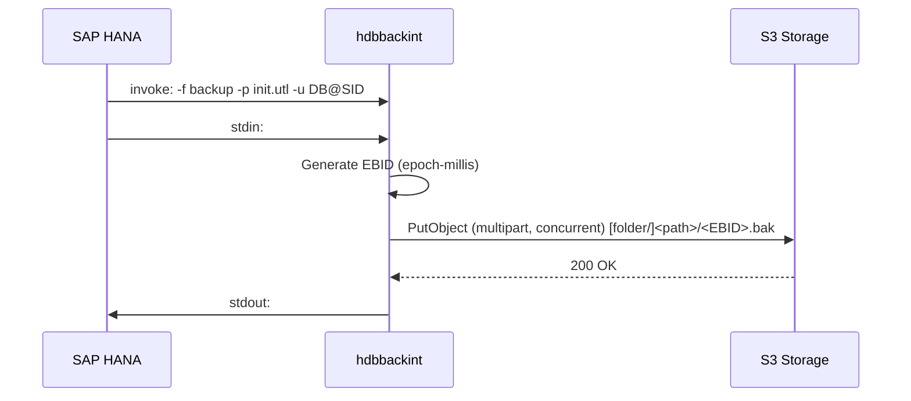
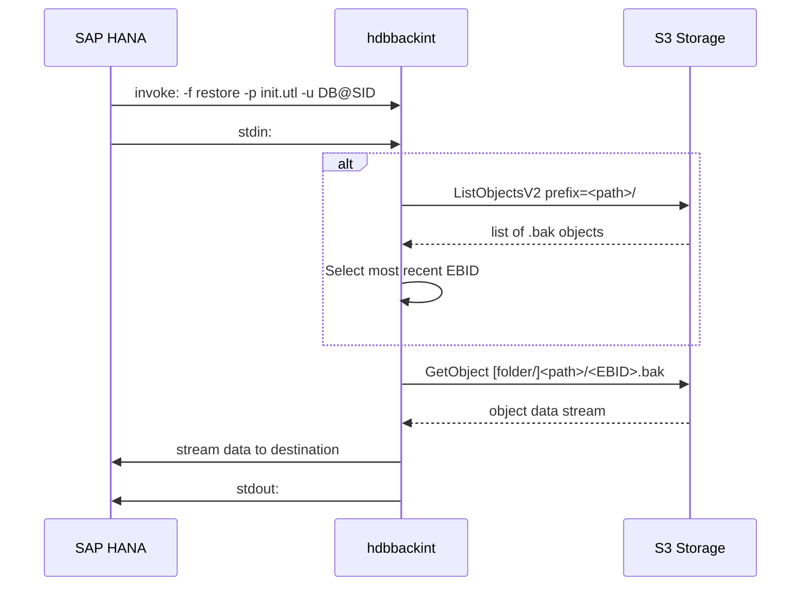

[](https://api.reuse.software/info/github.com/SAP-cloud-infrastructure/sap-hana-backup-integration)

# hdbbackint | sap-hana-backup-integration

[](LICENSE)
[](https://golang.org/)
[](https://me.sap.com/notes/3634779)

## About this project

SAP HANA Backint integration for S3-compatible object storage. Implements the Backint API v1.50.2 to backup, restore, inquire, and delete HANA database backups on CEPH/S3 storage.

## Overview



### Supported Operations

| Operation | Description |
|-----------|-------------|
| `backup`  | Upload HANA backup streams to S3 as versioned objects |
| `restore` | Download backup objects from S3 back to HANA |
| `inquire` | List backup metadata (all versions or specific EBID) |
| `delete`  | Remove a specific backup version from S3 |

## Architecture



### S3 Object Key Structure

**Default (full HANA path):**
```
[SCI_folderName/]<trimmed-hana-path>/<EBID>.bak

Example:
  prod/usr/sap/HXE/SYS/global/hdb/backint/SYSTEMDB/HXE_FULL_90_databackup_1_1/1734105678123.bak
```

**With `shorten_folder_path=true`:**
```
[SCI_folderName/]<SID>/<DBNAME>/<file>/<EBID>.bak

Example:
  prod/HXE/SYSTEMDB/HXE_FULL_90_databackup_1_1/1734105678123.bak
```

- **EBID** (External Backup ID): epoch-milliseconds UTC timestamp, generated at backup time.
- **SID** is always preserved in the key so multi-system environments remain correctly scoped.

## Getting Started

### Requirements

- Go 1.26.4 or later [only for building the binary]
- An S3-compatible storage bucket with write access (CEPH, AWS S3, MinIO, etc.)
- SAP HANA (any version supporting Backint API 1.50.2)

### Build

```bash
git clone https://github.com/SAP-cloud-infrastructure/sap-hana-backup-integration.git
cd sap-hana-backup-integration
go build -o hdbbackint ./src/
```

### Install

Place the compiled binary where SAP HANA expects the Backint executable:

```bash
# Example path — adjust SID and version as appropriate
cp hdbbackint /usr/sap/<SID>/SYS/global/hdb/opt
chmod 755 /usr/sap/<SID>/SYS/global/hdb/opt/hdbbackint
```

## Configuration

Create a parameter file (`hdbbackint.cfg`) and protect it with appropriate file permissions — it contains credentials.

```bash
# Recommended location
/usr/sap/<SID>/SYS/global/hdb/opt/hdbbackint.cfg
chmod 600 /usr/sap/<SID>/SYS/global/hdb/opt/hdbbackint.cfg
```

### Region and Endpoint Auto-detection

`SCI_region` and `SCI_endpoint` must be set together, or omitted together:

| Scenario | Behaviour |
|----------|-----------|
| Both set | Used as-is — no metadata call. Use for cross-region or air-gapped deployments. |
| Both omitted | Auto-detected from the OpenStack instance metadata service (`169.254.169.254`). Standard SCI VM default. |
| Only one set | Startup error — set both or omit both. |

When auto-detecting, the region is derived from `availability_zone` in the metadata response (e.g. `eu-de-1b` → `eu-de-1`), and the endpoint is built using `SCI_endpoint_template`.

> **Note for users of the pre-built binary (GitHub Releases):** The distributed binary ships with a generic placeholder for `SCI_endpoint_template`. If you rely on auto-detection (i.e. you do not set `SCI_region` and `SCI_endpoint` explicitly), you must set `SCI_endpoint_template` in your `hdbbackint.cfg` to match your storage provider's URL pattern. If you set `SCI_region` and `SCI_endpoint` explicitly, the template is not used and no action is required.

### Parameter Reference

**Mandatory**

| Key | Description | Example |
|-----|-------------|---------|
| `SCI_accessKey` | S3 access key ID | `YOUR_ACCESS_KEY` |
| `SCI_secretKey` | S3 secret access key | `YOUR_SECRET_KEY` |
| `SCI_bucketName` | Target S3 bucket name | `hana-backup-bucket` |

**Region / Endpoint (set both or omit both)**

| Key | Description | Example |
|-----|-------------|---------|
| `SCI_region` | S3 region identifier | `eu-de-1` |
| `SCI_endpoint` | S3-compatible storage endpoint URL | `https://s3.eu-de-1.example.com` |
| `SCI_endpoint_template` | Template used when auto-detecting endpoint from region. `{region}` is replaced at runtime. The default value (`https://s3.{region}.example.com`) is a placeholder — set this to your actual storage provider's URL pattern. | `https://s3.{region}.example.com` |

**Optional**

| Key | Type | Default | Possible Values / Range | Description |
|-----|------|---------|------------------------|-------------|
| `SCI_folderName` | string | _(none)_ | Any valid S3 key prefix | Top-level folder prefix inside the bucket. Leading and trailing `/` are stripped automatically. |
| `SCI_s3ForcePathStyle` | bool | `false` | `true`, `false` | Use path-style S3 URLs (`https://endpoint/bucket/key`). Required for most CEPH RGW deployments. |
| `shorten_folder_path` | bool | `false` | `true`, `false` | Store objects as `[folder/]<SID>/<DBNAME>/<file>/<EBID>.bak` instead of the full HANA path. |
| `retries` | int | `3` | `0` – _(no upper limit)_ | Number of retry attempts for failed S3 operations. `0` disables retries. |
| `log_file` | string | _(none)_ | Absolute file path | Path to the log file. Must be set together with `log_level`; setting only one is a startup error. |
| `log_level` | string | `info` | `debug`, `info`, `warn`, `error` | Log verbosity. Must be set together with `log_file`. |
| `log_rotate_frequency` | string | `never` | `never`, `day`, `hour`, `minute` | How often the log file is rotated. Rotated files are renamed to `<log_file>.<timestamp>`. |
| `tagging` | bool | `false` | `true`, `false` | Enable S3 object tagging. When enabled, `hdbbackint_version` and `db_version` are always applied. |
| `object_tags` | string | _(none)_ | Comma-separated `key=value` pairs, max 5 | Custom object tags applied when `tagging=true`. Example: `environment=prod,team=dba`. |
| `upload_part_size` | int | `134217728` | Min: `5242880` (5 MiB), Max: `268435456` (256 MiB) | Multipart upload part size in bytes. Values outside the range are a startup error. |
| `upload_concurrency` | int | `32` | Min: `1`, Max: `200` | Concurrent part uploads per file (AWS SDK level). Values outside the range are a startup error. |
| `upload_channel_size` | int | `10` | Min: `1`, Max: `32` | Number of files uploaded in parallel (goroutine pool). Values outside the range are a startup error. |
| `sse_enabled` | bool | `false` | `true`, `false` | Enable per-object SSE-KMS encryption on all backup uploads. |
| `sse_kms_key_id` | string | _(none)_ | KMS key UUID | KMS key UUID to use for SSE-KMS. Required when `sse_enabled=true`; startup fails if missing. |

### Sample Parameter File

```ini
# /usr/sap/PRD/SYS/global/hdb/opt/hdbbackint.cfg

SCI_accessKey=<YOUR_ACCESS_KEY>
SCI_secretKey=<YOUR_SECRET_KEY>
SCI_bucketName=hana-backup-bucket

# Region and endpoint — omit both for auto-detection on SCI VMs
# SCI_region=eu-de-1
# SCI_endpoint=https://s3.eu-de-1.example.com

# Optional
# SCI_folderName=hana-backups
# log_file=/var/log/hdbbackint/hdbbackint.log
# log_level=info
# log_rotate_frequency=day
# retries=3
# upload_part_size=134217728
# upload_concurrency=32
# upload_channel_size=10
# tagging=false
# sse_enabled=false
# sse_kms_key_id=
```

## Usage

hdbbackint is invoked by SAP HANA automatically. The CLI follows the Backint API 1.50.2 specification.

```
hdbbackint -f <function> -p <param_file> -u <user@SID> [options]
```

### TOOLOPTION — Runtime Parameter Override

SAP HANA can pass an option string to hdbbackint at runtime via the `TOOLOPTION` clause of the SQL backup command. Two formats are supported:

**Format 1 — Replace the entire parameter file:**

```sql
BACKUP DATA ALL USING BACKINT ('my-backup') TOOLOPTION 'PARAMETER_FILE=/path/to/override.cfg';
```

- All parameters are loaded from the specified file (same format as `hdbbackint.cfg`).
- The file must be accessible and contain all mandatory fields (`SCI_accessKey`, `SCI_secretKey`, `SCI_bucketName`).
- Log settings (`log_file`, `log_level`, `log_rotate_frequency`) are always taken from the original `-p` file — they cannot be changed at runtime.
- Backup fails with `#ERROR` if the file is not accessible or fails validation.

**Format 2 — Override individual parameters inline:**

```sql
BACKUP DATA ALL USING BACKINT ('my-backup') TOOLOPTION 'SCI_folderName=my-folder;tagging=true;object_tags=env=prod';
```

- Semicolon-separated `key=value` pairs. Keys must match parameter names exactly (case-sensitive).
- Each valid key overrides the corresponding value from the `-p` file for this backup only.
- Log fields (`log_file`, `log_level`, `log_rotate_frequency`) are warned and silently ignored.
- Unknown keys are a hard error (`#ERROR` + backup fails).
- Invalid values (out of range, wrong type, cross-field violations) are a hard error.

**Notes:**
- HANA allows only one `TOOLOPTION` clause per SQL backup command.
- Single quotes must be used in the SQL command (SQL string literal).
- Maximum option string length: 512 bytes (enforced by HANA).


### Flags

| Flag | Description |
|------|-------------|
| `-f` | **Mandatory.** Function: `backup`, `restore`, `inquire`, `delete` |
| `-p` | **Mandatory.** Path to the `.utl` parameter file |
| `-u` | User ID in `DBNAME@SID` format (provided by HANA) |
| `-i` | Input file path (default: `stdin`) |
| `-o` | Output file path (default: `stdout`) |
| `-s` | HANA session/backup ID (informational) |
| `-c` | Number of objects in the backup (informational) |
| `-l` | Backup level (informational) |
| `-v` | Print short version string and exit |
| `-V` | Print detailed version string and exit |

### Operational Flows

#### Backup



Multiple files are uploaded concurrently (up to `upload_channel_size` parallel goroutines).

#### Restore



#### Inquire

```
Input:  #NULL                        → list all backups for tenant
        #NULL /path/to/file          → list all versions of a specific file
        #EBID <id> /path/to/file     → metadata for a specific version
Output: #BACKUP "<EBID>" "<file>" "<timestamp>"
```

#### Delete

```
Input:  #EBID <id> /path/to/file
Output: #DELETED "<EBID>" "<file>"
        #NOTFOUND "<EBID>" "<file>"   (if not found)
```

## Logging and Troubleshooting

Diagnostic messages are written to the file configured via `log_file` and `log_level`. When unset, no log file is created. SAP HANA also captures stderr in its own `backint.log` per tenant.

```bash
# HANA-managed backint log per tenant
cat /usr/sap/<SID>/HDB<instance>/<hostname>/trace/DB_<tenant>/backint.log

# hdbbackint dedicated log (when log_file is configured)
tail -f /var/log/hdbbackint/hdbbackint.log
```

Log lines include a `[SID][DB_NAME][backup_level]` tag on every line, making it straightforward to correlate entries across concurrent sessions.

Common issues:

| Symptom | Likely Cause |
|---------|-------------|
| `#ERROR failed to load S3 config` | Missing or malformed `hdbbackint.cfg` |
| `SCI_region and SCI_endpoint auto-detection failed` | Running outside an SCI VM with no instance metadata service; set both explicitly |
| `SCI_region is set but SCI_endpoint is missing` | Set both together or omit both |
| `#NOTFOUND` on restore | EBID or path mismatch; object may have been deleted |
| S3 connection refused | Wrong `SCI_endpoint` or network/firewall issue |
| `SignatureDoesNotMatch` | Incorrect `SCI_accessKey` or `SCI_secretKey` |
| Empty list on inquire | `SCI_folderName` mismatch, wrong bucket, or `shorten_folder_path` mismatch |
| `sse_kms_key_id must be set` | `sse_enabled=true` but `sse_kms_key_id` is missing |
| `#ERROR #TOOLOPTION PARAMETER_FILE not accessible` | File path in `PARAMETER_FILE=` does not exist or is not readable |
| `#ERROR TOOLOPTION: unknown key` | Key in inline TOOLOPTION string does not match any known parameter name |
| `#ERROR TOOLOPTION: invalid value` | Value in inline TOOLOPTION string fails validation (out of range, wrong type, or cross-field rule) |

## Support, Feedback, Contributing

This project is open to feature requests/suggestions, bug reports etc. via [GitHub issues](https://github.com/SAP-cloud-infrastructure/sap-hana-backup-integration/issues). Contribution and feedback are encouraged and always welcome. For more information about how to contribute, the project structure, as well as additional contribution information, see our [Contribution Guidelines](CONTRIBUTING.md).

## Security / Disclosure
If you find any bug that may be a security problem, please follow our instructions at [in our security policy](https://github.com/SAP-cloud-infrastructure/sap-hana-backup-integration/security/policy) on how to report it. Please do not create GitHub issues for security-related doubts or problems.

## Code of Conduct

We as members, contributors, and leaders pledge to make participation in our community a harassment-free experience for everyone. By participating in this project, you agree to abide by its [Code of Conduct](https://github.com/SAP/.github/blob/main/CODE_OF_CONDUCT.md) at all times.

## Licensing

Copyright 2026 SAP SE or an SAP affiliate company and sap-hana-backup-integration contributors. Please see our [LICENSE](LICENSE) for copyright and license information. Detailed information including third-party components and their licensing/copyright information is available [via the REUSE tool](https://api.reuse.software/info/github.com/SAP-cloud-infrastructure/sap-hana-backup-integration).
