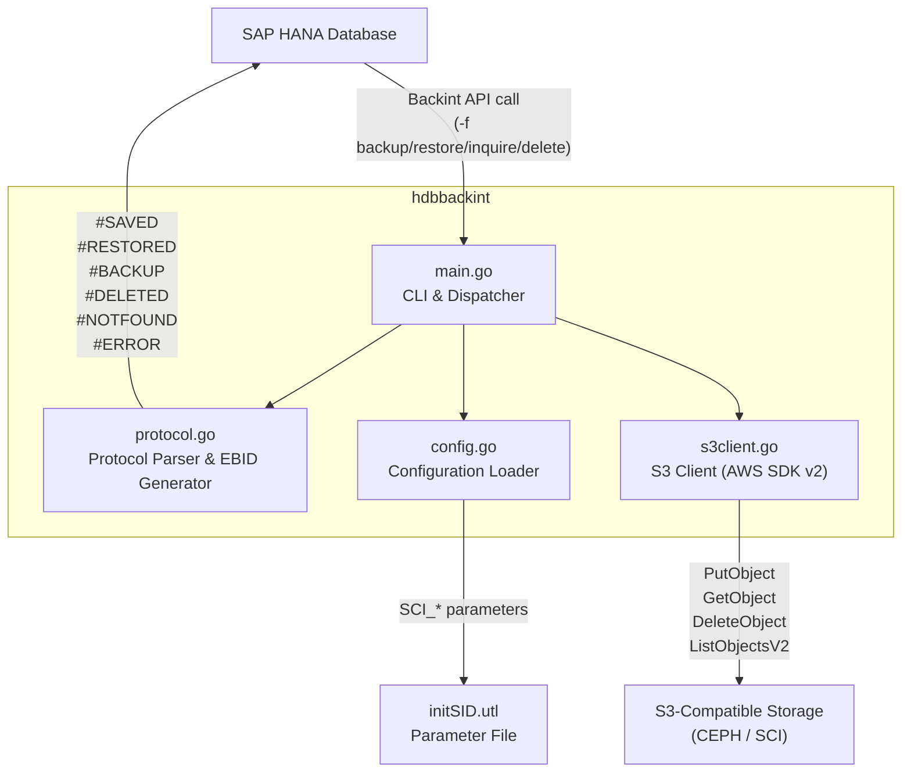
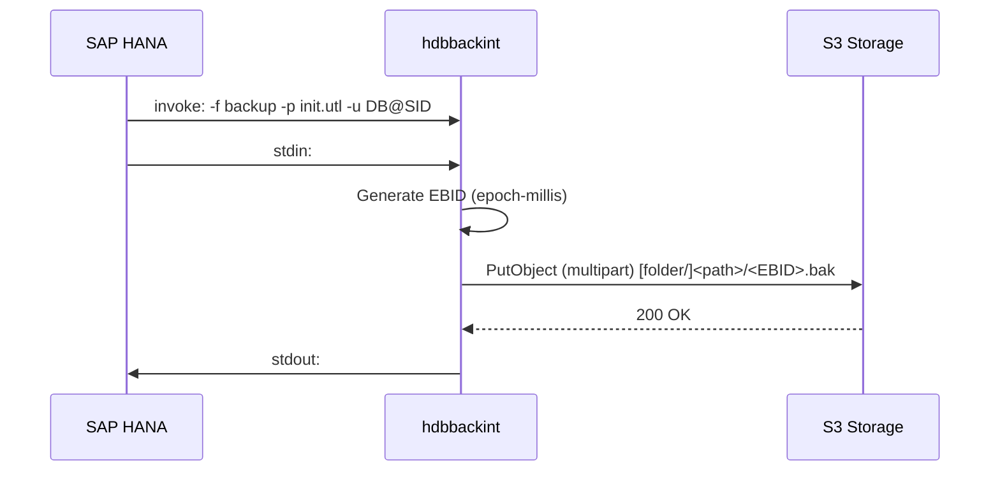
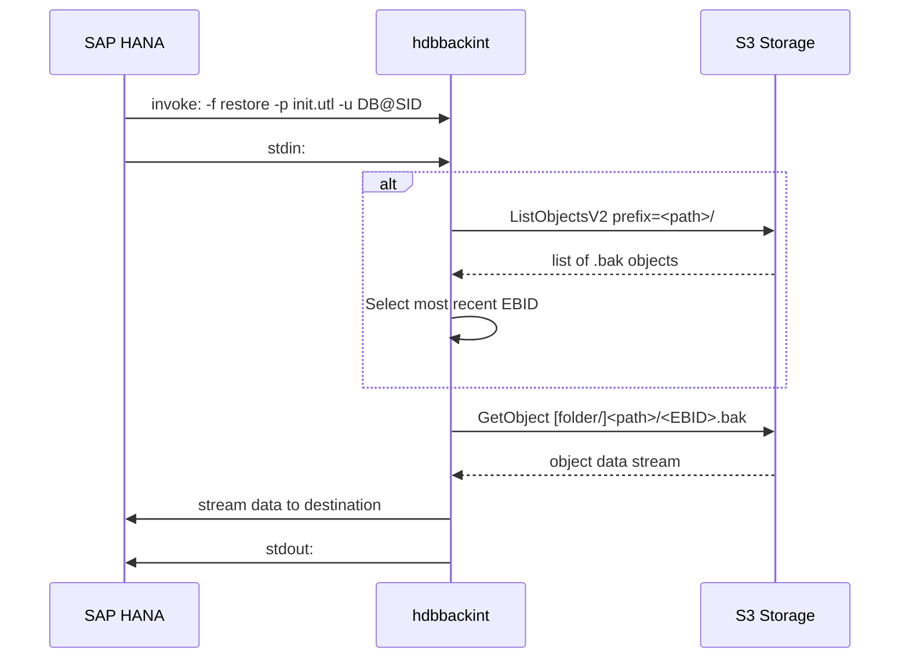

[](https://api.reuse.software/info/github.com/SAP-cloud-infrastructure/sap-hana-backup-integration)

# sap-hana-backup-integration

[](LICENSE)
[](https://golang.org/)
[](https://me.sap.com/notes/3634779)

## About this project

SAP HANA Backint integration for S3-compatible object storage. Implements the Backint v1.50 to backup, restore, inquire, and delete HANA database backups on CEPH storage.

## Overview


### Supported Operations

| Operation | Description |
|-----------|-------------|
| `backup`  | Upload HANA backup streams to S3 as versioned objects |
| `restore` | Download backup objects from S3 back to HANA |
| `inquire` | List backup metadata (all versions or specific EBID) |
| `delete`  | Remove a specific backup version from S3 |

## Architecture



### S3 Object Key Structure

```
[SCI_folderName/]<trimmed-hana-path>/<EBID>.bak

Examples:
  With folder:    prod/usr/sap/HXE/SYS/global/hdb/backint/SYSTEMDB/HXE_FULL_90_20260409125112_backup_databackup_1_1/1734105678123.bak
  Without folder: usr/sap/HXE/SYS/global/hdb/backint/SYSTEMDB/HXE_FULL_90_20260409125112_backup_databackup_1_1/1734105678123.bak
```

- **EBID** (External Backup ID): epoch-milliseconds UTC timestamp, generated at backup time.
- **Trimmed HANA path**: original HANA file path with the leading `/` removed.

## Getting Started

### Prerequisites

- Go 1.26 or later
- An S3-compatible storage bucket with write access (CEPH, AWS S3, MinIO, etc.)
- SAP HANA (any version supporting Backint API 1.50)

### Build

```bash
git clone https://github.com/SAP-cloud-infrastructure/sap-hana-backup-integration.git
cd sap-hana-backup-integration
go build -o hdbbackint ./src/
```

### Install

Place the compiled binary where SAP HANA expects the Backint executable:

```bash
# Example path — adjust SID and version as appropriate
cp hdbbackint /usr/sap/<SID>/SYS/global/hdb/opt
chmod 755 /usr/sap/<SID>/SYS/global/hdb/opt/hdbbackint
```

## Configuration

Create a parameter file (`hdbbackint.cfg`) and protect it with appropriate file permissions — it contains credentials.

```bash
# Recommended location
/usr/sap/<SID>/SYS/global/hdb/opt/hdbbackint.cfg
chmod 600 /usr/sap/<SID>/SYS/global/hdb/opt/hdbbackint.cfg
```

### Parameter Reference

| Key | Required | Description | Example |
|-----|----------|-------------|---------|
| `SCI_endpoint` | Yes | S3-compatible storage endpoint URL | `https://s3.example.com` |
| `SCI_accessKey` | Yes | S3 access key ID | `Tomato` |
| `SCI_secretKey` | Yes | S3 secret access key | `Potato` |
| `SCI_bucketName` | Yes | Target S3 bucket name | `hana-backup-bucket` |
| `SCI_region` | No | S3 region identifier | `eu-de-2` |
| `SCI_folderName` | No | Top-level folder prefix inside the bucket | `hanavm001` |
| `SCI_s3ForcePathStyle` | No | Use path-style addressing (required for MinIO) | `true` |

### Sample Parameter File

```ini
# /usr/sap/PRD/SYS/global/hdb/opt/hdbbackint.cfg

SCI_endpoint=https://s3.example.com
SCI_region=eu-de-2
SCI_accessKey=YOUR_ACCESS_KEY
SCI_secretKey=YOUR_SECRET_KEY
SCI_bucketName=hana-backup-bucket

# Optional
# SCI_folderName=hanavm001
```

## Usage

hdbbackint is invoked by SAP HANA automatically. The CLI follows the Backint API 1.50 specification.

```
hdbbackint -f <function> -p <param_file> -u <user@SID> [options]
```

### Flags

| Flag | Description |
|------|-------------|
| `-f` | **Mandatory.** Function: `backup`, `restore`, `inquire`, `delete` |
| `-p` | **Mandatory.** Path to the `.utl` parameter file |
| `-u` | User ID in `DBNAME@SID` format (provided by HANA) |
| `-i` | Input file path (default: `stdin`) |
| `-o` | Output file path (default: `stdout`) |
| `-s` | HANA session/backup ID (informational) |
| `-c` | Number of objects in the backup (informational) |
| `-l` | Backup level (informational) |
| `-v` | Print short version string and exit |
| `-V` | Print detailed version string and exit |

### Operational Flows

#### Backup



#### Restore



#### Inquire

```
Input:  #NULL                        → list all backups for tenant
        #NULL /path/to/file          → list all versions of a specific file
        #EBID <id> /path/to/file     → metadata for a specific version
Output: #BACKUP "<EBID>" "<file>" "<timestamp>"
```

#### Delete

```
Input:  #EBID <id> /path/to/file
Output: #DELETED "<EBID>" "<file>"
        #NOTFOUND "<EBID>" "<file>"   (if not found)
```

## Logging and Troubleshooting

All operational diagnostic messages are written to **stderr**. SAP HANA captures these automatically in the `backint.log` file for each database tenant.

```bash
# View backint logs for a HANA tenant
cat /usr/sap/<SID>/HDB<instance>/<hostname>/trace/DB_<tenant>/backint.log
```

Common issues:

| Symptom | Likely Cause |
|---------|-------------|
| `#ERROR Failed to load S3 configuration` | Missing or malformed `hdbbackint.cfg` file |
| `#NOTFOUND` on restore | EBID or path mismatch; object may have been deleted |
| S3 connection refused | Wrong `SCI_endpoint` or network/firewall issue |
| `SignatureDoesNotMatch` | Incorrect `SCI_accessKey` or `SCI_secretKey` |
| Empty list on inquire | `SCI_folderName` mismatch or wrong bucket |


## Support, Feedback, Contributing

This project is open to feature requests/suggestions, bug reports etc. via [GitHub issues](https://github.com/SAP-cloud-infrastructure/sap-hana-backup-integration/issues). Contribution and feedback are encouraged and always welcome. For more information about how to contribute, the project structure, as well as additional contribution information, see our [Contribution Guidelines](CONTRIBUTING.md).

## Security / Disclosure
If you find any bug that may be a security problem, please follow our instructions at [in our security policy](https://github.com/SAP-cloud-infrastructure/sap-hana-backup-integration/security/policy) on how to report it. Please do not create GitHub issues for security-related doubts or problems.

## Code of Conduct

We as members, contributors, and leaders pledge to make participation in our community a harassment-free experience for everyone. By participating in this project, you agree to abide by its [Code of Conduct](https://github.com/SAP/.github/blob/main/CODE_OF_CONDUCT.md) at all times.

## Licensing

Copyright 2026 SAP SE or an SAP affiliate company and sap-hana-backup-integration contributors. Please see our [LICENSE](LICENSE) for copyright and license information. Detailed information including third-party components and their licensing/copyright information is available [via the REUSE tool](https://api.reuse.software/info/github.com/SAP-cloud-infrastructure/sap-hana-backup-integration).
